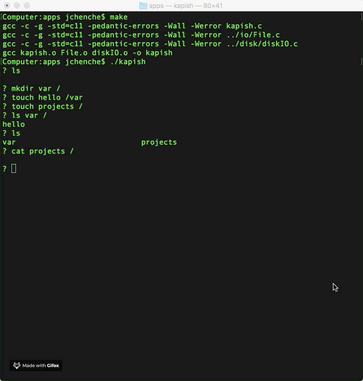

# File-system assignment
- Name: Jimmy Chen Chen.  
- Grade acquired: 100%.  
- Class: CSC360 (Operating Systems).  
- Convention for this project: returning 0 and 1 usually denotes failure and success respectively.  
- Type: Flavour of the original UNIX filesystem (partitioned in 512 bytes blocks).  

# HOW TO RUN:
- Only 2 commands to run. Go to folder /apps and type `make` then `./kapish`  
- When kapish runs with the --test flag, it'll read and execute some test commands in a test file  
- paths must be absolute and always start with /  

# DEMO:
- Note that "sample" is a file that exists in the **/apps directory (outside of this filesystem)**, but "projects" exists in the **root directory of this filesystem**.  
- Refer to the next section for available commands.  

# USING THE KAPISH SHELL:
- `init` will create and initialize the disk  
- `touch [filename] [path]` will create a file in a directory specified by path. e.g `touch hello /var/tmp` will create the file named hello in directory tmp. Directories var and tmp must exist (in the suggested tree structure /var/tmp)  
- `rm [filename] [path]`  
- `mkdir [directory name] [path]`  
- `rmdir [directory name] [path]`  
- `append [src filename] [dest filename] [path]` will append data from src to dest. src must exist in the current directory (local machine) and dest must exist in path (this filesystem)  
- `cat [filename] [path]`  will read data from filename in path  
- `ls [directory name] [path]` will list all the files of the directory within another directory given by path (typing just ls will list the files in the root directory). e.g `ls tmp /var` will list all the files in the directory named tmp that is inside the directory called var which is inside the root directory.  
- `clear` will clear the screen.  
- `exit` or `Ctrl-D` will exit the program.  

# DESIGN DECISIONS:
- The inode structure consists of the file size, file type, and pointers to the blocks that contain the data for the file. inode_id ranges from 2 to 127 each occupying one block. There're 126 inodes because it makes working with the bitmap vector easier as the first 2 blocks are for the superblock (block 0) and bitmap block (block 1) respectively, so there are 128 (divisible by 8) blocks for metadata.  
- Drop indirect pointers because we only have 4096 blocks anyways. inodes will instead contain 252 direct pointers (occupying 2 bytes each) because I have an entire block for each inode to use anyways. inodes first 8 bytes are for file size and file type, so 252 * 2 + 8 = 512 bytes. File max size will then be 512 * 252 = 129024 bytes which is about 1/16 of disk space.   
- For file types, 0 is used for directories and 1 is used for flat files.  
- For the bitmap vector block, 0 means occupied and 1 means free.  
- When a file is created (flat or directory), it'll also allocate one data block for it. Deallocation of inode block and data block happens when there's an error in creating a file.  
- Write() actually appends data at the end.  
- If file size is smaller than the intended size to be read, Read() will only read until the last file data byte and not go beyond.  
- For filesystem robustness, I used 5 bytes in the superblock for that purpose (unused space anyways). When I create a file, I start the transaction by assigning 'T' to an area in the superblock and when I am done creating a file, I end the transaction by assigning 't' to the same area. This way, the function becomes atomic. To check the filesystem robustness, run file_system_check(). If it doesn't see 't' in the mentioned memory area, then the filesystem is corrupted and it will proceed to fix it.  
